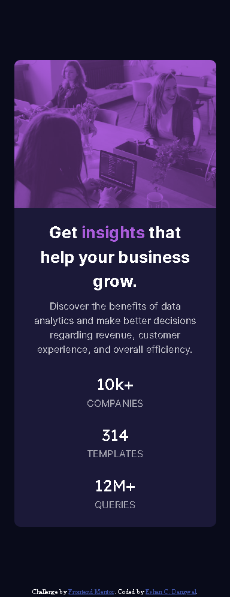
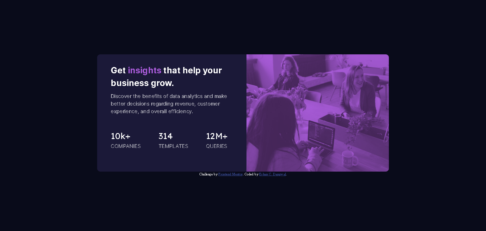

# Frontend Mentor - Stats preview card component solution

This is a solution to the [Stats preview card component challenge on Frontend Mentor](https://www.frontendmentor.io/challenges/stats-preview-card-component-8JqbgoU62). Frontend Mentor challenges help you improve your coding skills by building realistic projects.

## Table of contents

- [Overview](#overview)
  - [The challenge](#the-challenge)
  - [Screenshot](#screenshot)
  - [Links](#links)
- [My process](#my-process)
  - [Built with](#built-with)
  - [What I learned](#what-i-learned)
  - [Continued development](#continued-development)
  - [Useful resources](#useful-resources)
- [Author](#author)

## Overview

### The challenge

Users should be able to:

- View the optimal layout depending on their device's screen size

### Screenshot

- Mobile design

  

- Desktop design
  

### Links

- Solution URL: [Click here](https://your-solution-url.com)
- Live Site URL: [Click here](https://eshan01.github.io/stats-preview-card/)

## My process

### Built with

- Semantic HTML5 markup
- CSS custom properties
- Flexbox
- CSS Grid
- Mobile-first workflow

### What I learned

-CSS Blend Property

### Continued development

- Flexbox
- CSS Grid
- CSS Blend

### Useful resources

- [CSS Blend Property](https://www.w3schools.com/cssref/pr_background-blend-mode.asp)

## Author

- Frontend Mentor - [@yourusername](https://www.frontendmentor.io/profile/yourusername)
